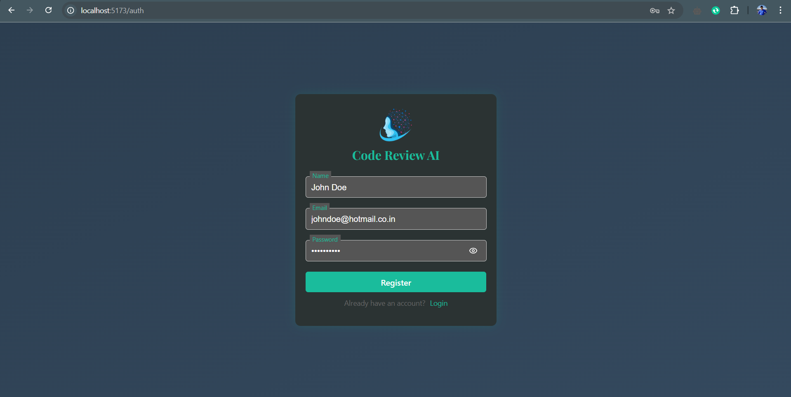
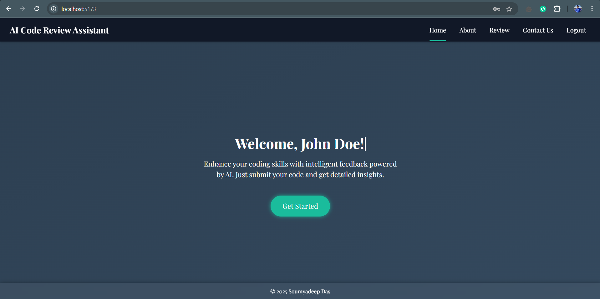
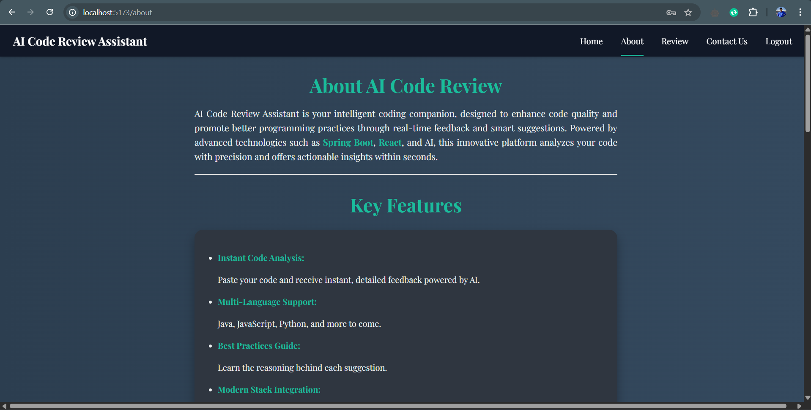
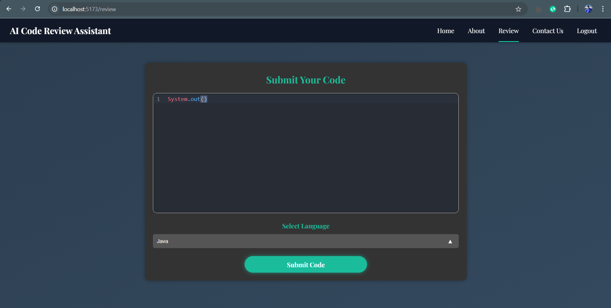
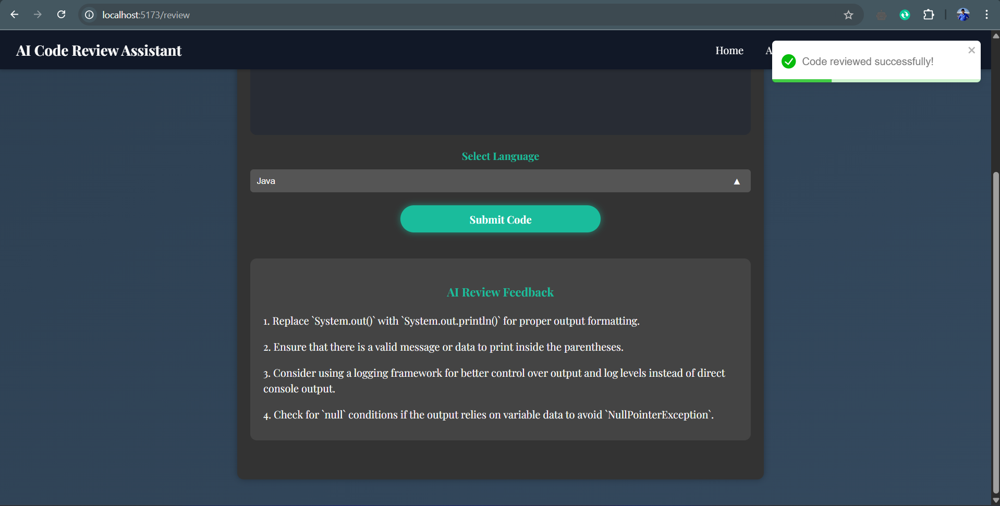
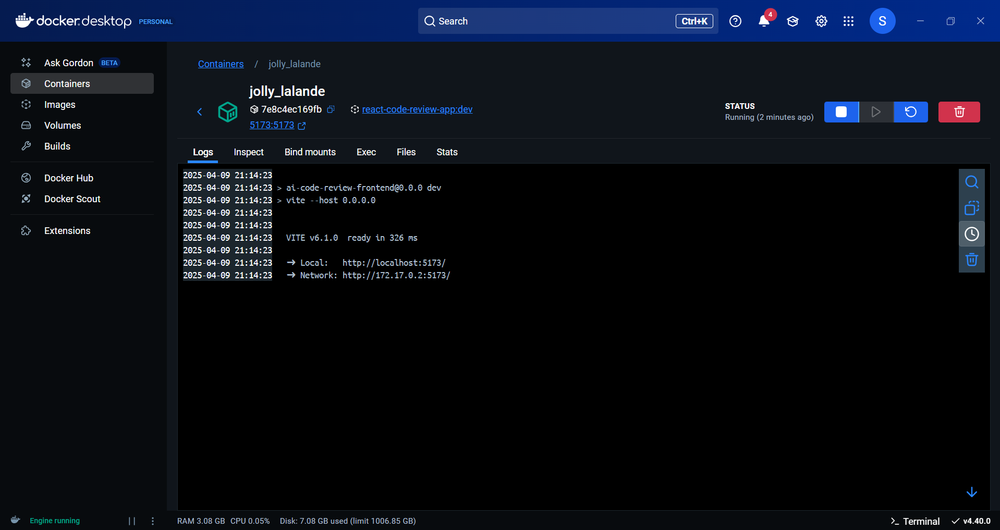

# AI Code Review Assistant

## 🚀 Overview
This is the **frontend** of the Code Review Assistant, a web-based AI-powered tool that reviews and suggests improvements for code snippets. The application provides a user-friendly interface for submitting code, viewing AI feedback, and improving coding practices.

## 📸 Application Screenshots

### 🔹 Authentication Page


### 🔹 Home Page


### 🔹 About Page


### 🔹 Contact Page


### 🔹 Code Review in Action



### 🔹 Containerization (Docker) - Frontend



## 🛠 Tech Stack
- **Framework:** React (TypeScript)
- **UI/Styling:** Tailwind CSS, HTML, CSS, Framer Motion, Google Fonts
- **State Management:** React (Context API)
- **Authentication:** JWT
- **API Communication:** Axios
- **Email Integration:** EmailJS
- **Deployment:** Docker
> ℹ️ *Kubernetes may be used in the future for scalability.*

---

## 📦 Installation & Setup

### Prerequisites
- Node.js (>= 18.x)
- npm (or yarn)

### 1️⃣ Clone the Repository
```sh
git clone https://github.com/your-username/code-review-assistant-frontend.git
cd code-review-assistant-frontend
```

### 2️⃣ Install Dependencies
```sh
npm install  # or yarn install
```

### 3️⃣ Run the Development Server (Locally)
```sh
npm run dev  # or yarn dev
```
The app should now be running on **http://localhost:5173**.
>💡 Make sure the [backend](https://github.com/soumyadeep6845/code-review-assistant-backend) is up and running on http://localhost:8080.

---

## 📧 EmailJS Setup (For Contact Page)

To enable the contact form email functionality using **EmailJS**, follow these steps:

### 🔐 Create a `.env` file

Create a `.env` file in the root directory of your project and **ensure it is added to `.gitignore`** to avoid committing sensitive credentials.

```env
VITE_EMAILJS_SERVICE_ID=<your-service-id>
VITE_EMAILJS_TEMPLATE_ID=<your-template-id>
VITE_EMAILJS_PUBLIC_KEY=<your-public-key>
```

### 🛠 How to Obtain EmailJS Credentials

1. Go to [EmailJS](https://www.emailjs.com/) and **create a free account**.
2. In the dashboard:
   - ➕ **Add a new Email Service** and connect it to a valid email (e.g., Gmail, Outlook).
   - 📝 **Create a new Email Template** — make sure it includes all required fields that match your form input names.
   - 🔑 Go to **Account** → Copy your **Public Key**.
3. 🧩 Paste the above three values into your `.env` file.

### 💡 Note

Make sure that:

- ✅ The form field names in your React component match the template variables you’ve added in the EmailJS template.
- 🔄 Restart your app after making any changes to the `.env` file.

---

## 🐳 Run with Docker

To build and run the application using **Docker**:

```sh
docker build -t code-review-frontend:dev .
docker run -p 5173:5173 code-review-frontend:dev
```
The app will be accessible at **http://localhost:5173**.

---

## 📌 Features

✅ Submit code snippets for AI-based review  
✅ View AI-generated feedback  
✅ Responsive and modern UI using Tailwind CSS  
✅ Secure API communication with the backend  
✅ Containerised using Docker  

---

## 📜 Folder Structure
```
 code-review-assistant-frontend/
 ┣  screenshots/   # Application screenshots
 ┣  src/
 ┣  ┣  api/        # API components and integration
 ┣  ┣  assets/     # Visual assets
 ┣  ┣  components/ # UI components
 ┣  ┣  pages/      # Application pages
 ┣  ┣  utils/      # Routes
 ┣  ┣  App.tsx     # Main application entry
 ┣  ┣  main.tsx    # React root file
 ┣  Dockerfile     # Docker configuration
 ┣  .env           # Stored secrets & keys
 ┣  README.md
```

---

## 🎯 Contribution

If you'd like to contribute, feel free to **fork** the repository, create a **new branch**, and raise a **pull request** with changes you deem necessary!

## 💚 Found this project interesting?

If you found this project useful, then please consider leaving a ⭐ on [GitHub](https://github.com/soumyadeep6845/code-review-assistant-frontend). Thank you! 😄

## 👨 Project Maintained By

[Soumyadeep Das](https://www.linkedin.com/in/soumya0021/)
